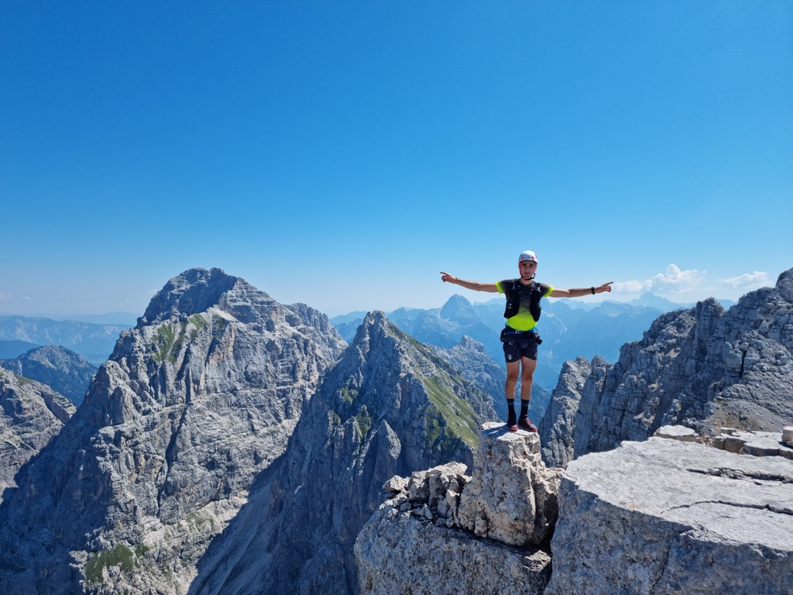
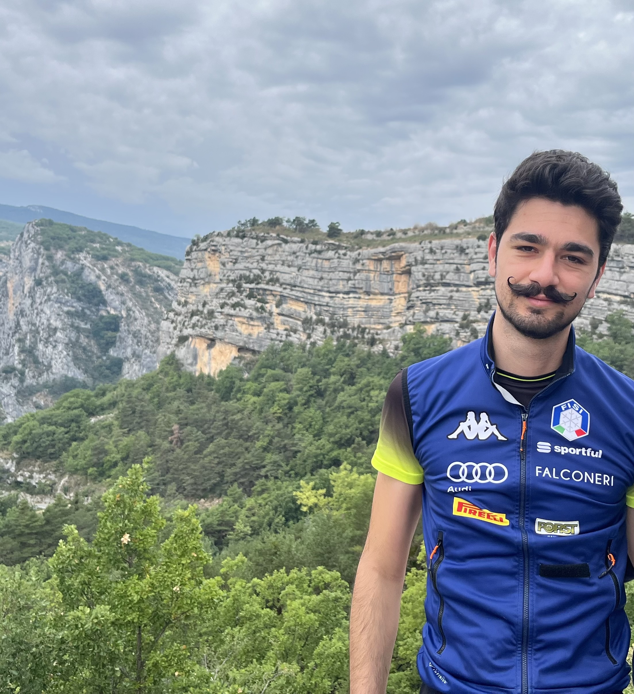

::: {.about-container}

::: {.about-photos}
{.about-photo}

{.about-photo}

:::

::: {.about-text}
I'm an [M.Sc. student in Applied Psychology]{.highlight} at the
University of Trieste, working at the intersection of [statistical
genomics, computational modelling, and psychology]{.highlight} to
understand the biological mechanisms underlying complex psychiatric
traits.

My long-term goal is to [bridge clinical and psychological knowledge
with quantitative genomic models]{.highlight} — using genome-wide
association studies, polygenic models, and predictive approaches to
better understand individual differences in behaviour and mental
health. I'm particularly drawn to [Bayesian modelling, omics data, and
machine learning]{.highlight} as tools for capturing this complexity.

I also love meeting people from different backgrounds — I believe the best 
insights often emerge when different fields come together to approach the same
question from multiple perspectives.

Outside academia, I enjoy spending time in nature, particularly hiking
and exploring mountain environments. And yes, the moustache? It
started as a bet, but somehow it has become part of my
identity. So, if you ever see a moustache
climbing up a mountain, do not hesitate to say hello — it is
probably me!

:::

:::